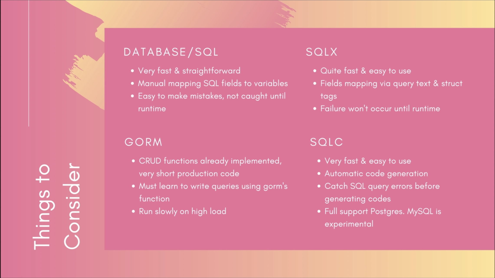

# simple-bank

## SQL script to create tables
Postgresql SQL statements to create `simple bank` tables exported <br>
from dbdiagram.io: [simple bank](https://dbdiagram.io/d/simple-bank-65c391b8ac844320aea89c27) <br>
to  `db/dbdiagram.io/simple-bank.sql`

## golang-migrate
Github Repo: [golang-migrate](https://github.com/golang-migrate/migrate)

**Installation**
`> brew install golang-migrate`

**Create migration with name `init_schema`**
```
> migrate create -ext sql -dir db/migration -seq init_schema

-ext sql                : sql extension
-dir db/migration       : store the migration files in directory db/migration
-seq                    : generate sequential version number for the migration files

```
**Edit db/migration/000001_init_schema.up.sql**
Copy and paste SQL script in `db/sql/simple-bank.sql` to `db/migration/000001_init_schema.up.sql`

**Edit db/migration/000001_init_schema.down.sql**
```
DROP TABLE IF EXISTS transfers;
DROP TABLE IF EXISTS entries;
DROP TABLE IF EXISTS accounts;
```

## Run Postgress database
```
> make postgres
```
## Install and connect to Postgress database with Table-Plus
```
> brew install --cask tableplus
```

## Create database simple_bank
```
> make createdb
```

## Drop database simple_bank
```
> make dropdb
```

## Migrate Up
```
> make migrateup
```
Refresh Table-Plus `Cmd + R`

## Migrate down
```
> make migratedown
```
Refresh Table-Plus `Cmd + R`

## Golang database libraries
 <br>
Decision: `sqlc` <br>
Installation: `> brew install sqlc` <br>
Configuration sqlc = `sqlc.yaml` <br>
Documentation [sqlc configuration](https://docs.sqlc.dev/en/stable/reference/config.html)

## Generate CRUD golang code from sql
Use `sqlc` to write sql code and transform into golang code <br>
See [sqlc documentation](https://docs.sqlc.dev/en/latest/)
The CRUD operations for tables `accounts`, `entries` and `transfers` of database simple_bank are specified in files:
```
db/query/account.sql
db/query/entry.sql
db/qquery/transfer.sql
```
Then: generate golang code
```
> make sqlc
```
The next golang code will be created in package "db"
```
/db/sqlc/account.sql.go          # CRUD operations table accounts
/db/sqlc/entry.sql.go            # CRUD operations table entries
/db/sqlc/transfers.sql.go        # CRUD operation table transfers
/db/sqlc/db.go                   # Queries struct that implements DBTX interface (DB=database, TX=Transaction)
/db/sqlc/model.go                # Struct for each table
```
Do not edit these golang files!!

